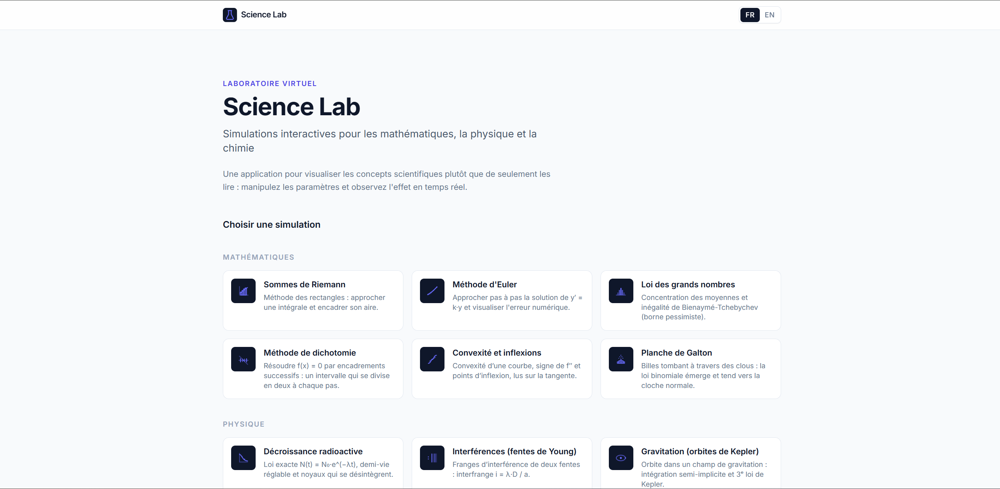
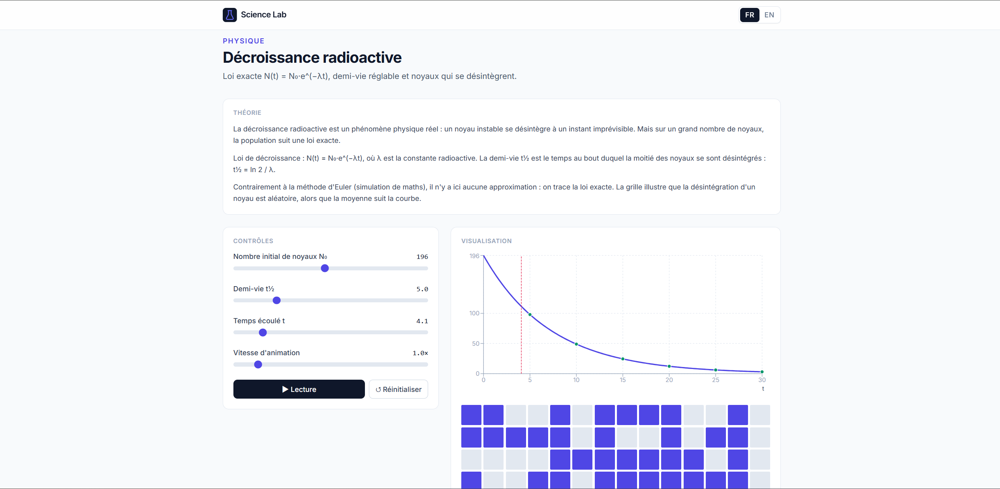

# Science Lab

Interactive science simulations for advanced high-school students, built to visualize
mathematics, physics, and chemistry concepts from the French curriculum.

Science Lab is a bilingual FR/EN web app. It runs entirely in the browser: no backend,
no database, no account, and no data collection.

Live site: https://oopslurp.github.io/science-lab/

## Preview





## Simulations

### Mathematics

- Riemann sums
- Euler method
- Law of large numbers
- Bisection method
- Convexity and inflection points
- Galton board

### Physics

- Radioactive decay
- Young's double-slit interference
- Kepler orbits
- Uniform field projectile motion
- Ideal gas
- Doppler effect

### Chemistry

- Chemical kinetics
- Strong acid / strong base titration
- Chemical equilibrium
- Predominance diagram
- Electrochemical cell
- Organic synthesis

## Stack

- Vite
- React
- TypeScript
- Tailwind CSS
- Recharts
- Vitest

## Local Development

```bash
npm install
npm run dev
```

Useful commands:

```bash
npm test
npm run build
npm run preview
```

## License

MIT License.

Copyright (c) 2026 Mathieu C.

## Credits

Created by Mathieu C.

Development assistance: Claude Code and ChatGPT.
